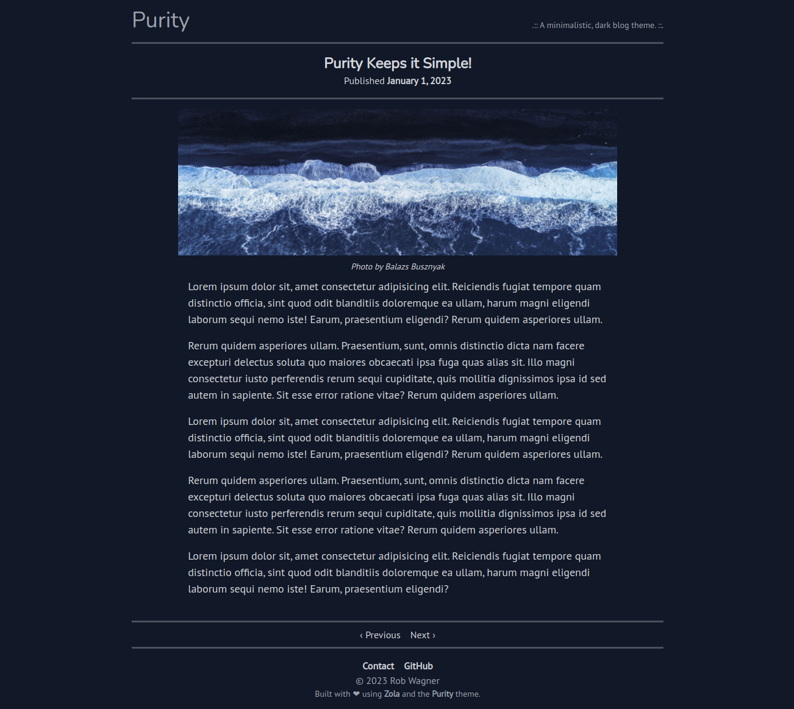

# Purity

Purity is a minimalistic, dark blog theme for [Zola](https://www.getzola.org/) built with TailwindCSS.

  

## Usage

See the [Zola documentation](https://www.getzola.org/documentation/themes/installing-and-using-themes/) for instructions on how to install and use themes.

## License

Purity source code is dual-licensed under either

- **[MIT License](/docs/LICENSE-MIT)**
- **[Apache License, Version 2.0](/docs/LICENSE-APACHE)**

at your option.
